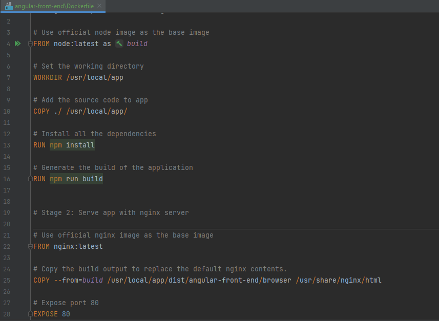

# Comment Dockeriser une Architecture de Microservices avec Docker et Spring Cloud

Cela nous permet d'automatiser le processus de démarrage des microservices.

## Étapes à suivre :

1. **Générer un fichier exécutable .jar avec la commande :**
   ```bash
   mvn clean package -DskipTests

### Creer un fichier DockerFile Pour chaque Microservice : 
  

### Intégrer Docker Compose en créant un fichier DockerCompose.yml :
Pour éviter d'avoir à lancer les commandes : docker build, docker run à chaque fois.  
  


### Demmarer Docker : et lancer la commande : 
#### docker compose up -d --build
  


### Passant maintenant a la partie FrontEnd
Premierement c'est de generer le build :  
On a integrer cette etape directement dans le Dockerfile :  
  

#### Automatiser le process de docker build , docker run  :  
en modifiant DockerCompose.yml :  
  

### Pour lancer l'app :  
   ```bash
   docker compose up -d --build


